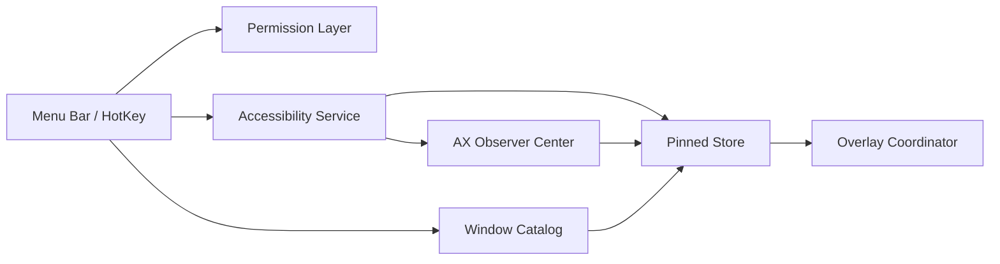

# DeskPins for macOS Architecture

## Architecture Decision

Adopt a public-API-first architecture:

- Accessibility APIs for focused window access, attributes, and event observation.
- `CGWindowListCopyWindowInfo` for visible window cataloging, filtering, and hit selection support.
- App-owned overlay windows for pin badge, border, ordering, and visual state.

This architecture intentionally avoids private API window server manipulation.

## Current Bootstrap State

The repository currently bootstraps through Swift Package Manager because full Xcode-backed macOS app builds are not available in the active local developer setup.

That means:

- core modules compile as SwiftPM targets
- verification currently uses `swift build` plus a smoke-test executable
- the menu bar app target will be added once full Xcode tooling is available

## Design Principles

- Separate window discovery from pinned presentation.
- Separate system events from persistent state.
- Keep permission boundaries explicit.
- Prefer recoverable degradation over fragile hacks.

## Module Layout

### `App/`

Owns:

- app startup
- menu bar status item
- settings entry
- lifecycle wiring

### `Core/Accessibility/`

Owns:

- Accessibility trust checks
- focused window lookup
- focused window snapshot adaptation into pinned references
- window attribute reads
- observer registration
- window-level actions such as raise when appropriate

### `Core/WindowCatalog/`

Owns:

- visible window enumeration
- filtering out noise windows
- searchable window list model
- weak matching between CGWindow data and pinned records

### `Core/Pinned/`

Owns:

- pinned window model
- weak window identity and bounds snapshots
- sort order policy
- persistence
- invalidation state
- pin, activate, observe, and unpin store operations

### `Core/Pinning/`

Owns:

- pin-current-window orchestration
- toggle-current-window orchestration
- bridge logic between Accessibility readers and the pinned store

### `Core/Overlay/`

Owns:

- pin badge presentation
- border and highlight overlays
- opacity and click-through behavior
- z-order application for app-owned overlays

### `Core/HotKey/`

Owns:

- global shortcut registration
- shortcut conflict feedback
- trigger routing into pin actions

## Data Flow

## Window Identity Strategy

Pinned windows should use weak composite identity, not a single perfect key.

Suggested fields:

- owner PID
- window title
- bounds snapshot
- CGWindow number
- last observed timestamp

Reason:

- titles change
- bounds change
- window numbers should not be treated as eternal identity

## Ordering Strategy

Default policy:

- use recent interaction time first
- fall back to recent pin time before interaction exists

Optional user setting:

- use recent pin time as the dominant rule

Important boundary:

The project can guarantee ordering for its own overlays more reliably than it can guarantee absolute system-wide ordering for arbitrary third-party windows.

## Event Strategy

Use notification-first with polling fallback.

Notifications cover:

- focused window changes
- movement
- resizing
- destruction

Polling scope:

- only pinned windows

Polling goals:

- location
- size
- visibility
- continued identity match

## Permission Model

### MVP

- Accessibility only

### Later

- Screen Recording, but only when content preview becomes a real feature

## Operational Constraints

- No private APIs in the mainline architecture.
- No Dock injection.
- No SIP-dependent features.
- No screen capture by default.
- Keep compatibility focused on the current official macOS line.

## MCP Workflow

### Current Core MCPs

- `filesystem`
- `git`
- `fetch`
- `openaiDeveloperDocs`

### Supporting MCPs

- `github`
- `context7`

### Future Optional MCP

- `XCF`, once the Xcode project is real and active
