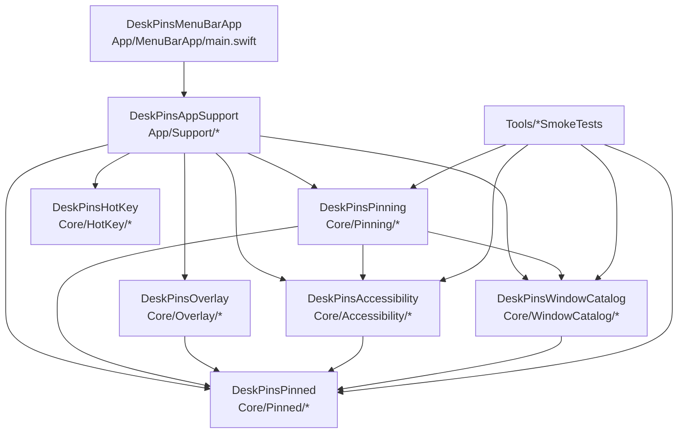
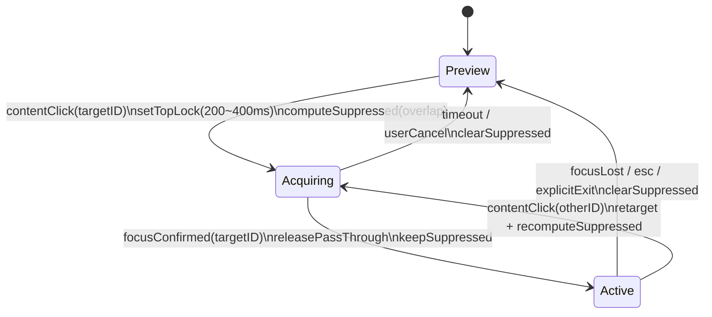
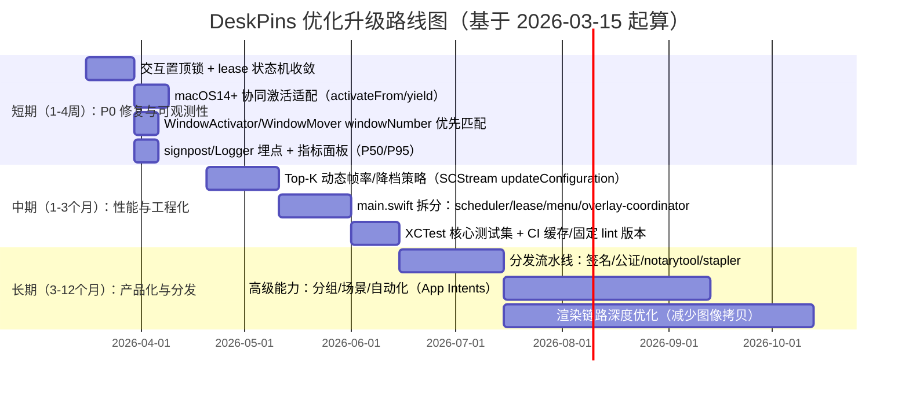

# DeskPins 项目深研：liam-harrison1/pin 代码与报告的优化升级建议

**执行摘要（≤200字）**：本报告审阅 `liam-harrison1/pin`（DeskPins）代码与配套深研文档，确认当前主要风险集中在：macOS 14+ “协同激活（cooperative activation）”语义变化导致的窗口激活/聚焦不确定性、交互租约（lease）状态机与排序/刷新节拍的竞态、以及多 pinned 重叠时“视觉最上层≠输入路由目标”的一致性问题。建议以“协同激活适配 + 窗口匹配加固（windowNumber 优先）+ 输入路由一致性矩阵 + 可观测性埋点”为主线分阶段升级，并以低回归风险方式收敛 P0 交互回归、同时保留 ScreenCaptureKit 预览的流畅度收益。fileciteturn32file0 fileciteturn31file0

## 现状概览与关键假设

项目定位为“仅用公开 API 的 macOS DeskPins 风格置顶工具”，主线 MVP 仅要求辅助功能（Accessibility），而镜像内容覆盖层（ScreenCaptureKit）作为实验/可选能力，需要屏幕录制权限。fileciteturn40file0 fileciteturn36file0 fileciteturn37file0

工程组织采用 SwiftPM 多模块拆分，菜单栏 App 作为可执行入口；核心能力分为：窗口枚举（CGWindowList）、焦点读取与窗口操作（AX）、Pinned 状态与排序、Overlay（三层浮窗：preview/drag/badge）、全局热键、AppSupport 编排。fileciteturn10file0 fileciteturn36file0 fileciteturn47file0

本报告在未收到以下关键约束时，按“多情景”给出建议，并将其列为待定项（建议在立项/排期前补齐）：
- 部署环境：默认面向 macOS 14+（SwiftPM platform 指定 macOS v14）。fileciteturn10file0  
- 目标用户规模：桌面软件通常“一机一用户”，但需要按 pinned 数量、窗口尺寸、屏幕数量评估资源上限（见性能节）。  
- 性能目标与预算/时间线：未指定；以“P0 交互正确性优先、性能不回退”为约束，给出 1–4 周/1–3 月/3–12 月路线图（见最后）。fileciteturn32file0 fileciteturn0file0

fileciteturn10file0 fileciteturn11file0 fileciteturn47file0

## 代码质量与架构评估

代码结构与模块边界总体清晰：`Docs/architecture.md` 先定义公开 API 优先的架构决策，再用 SwiftPM 模块将“窗口发现（catalog/focus）”与“pinned 状态”“overlay 呈现”“热键”分离，符合可维护性与可测试性的基本原则。fileciteturn36file0 fileciteturn10file0

可测试性方面，仓库在 bootstrap 阶段优先建设了 SmokeTests（`Tools/*SmokeTests`），覆盖 pinning workflow、catalog 过滤、pinned store 排序与持久化 schema 等，这能在没有完整 UI 测试栈前提供“可回归”的最低保障。fileciteturn50file0 fileciteturn64file0 fileciteturn53file0

但从“技术决策者”视角，现阶段的主要架构债务集中在以下三类（建议作为中期 refactor 目标）：

**应用层编排过载（main.swift / StateController 复杂度高）**  
`App/MenuBarApp/main.swift` 同时承担：NSStatusItem 菜单构建、定时刷新节拍、Overlay 交互事件处理、Overlay lease/握手、持久化/退出清理等职责，且存在多个并发 Task 与定时器交织，天然容易引入竞态与“难复现 P0”。fileciteturn11file0 fileciteturn32file0  
建议将“交互状态机（lease）”“刷新调度器”“menu presentation”“overlay coordinator”拆分为独立对象，并将关键状态转移收敛为纯函数/可测试 reducer（后文给出落地路线）。

**窗口身份（identity）策略在不同子系统实现不一致**  
项目已引入 `PinnedWindowReference` 并强化 `windowNumber` 优先匹配逻辑（windowNumber 相等直接命中，否则再以 title/bounds 弱匹配）。fileciteturn19file0  
但 `WindowActivator` / `WindowMover` 的匹配算法仍以 title/bounds 为主，未优先使用 `windowNumber`，在浏览器标题频繁变化或多窗口相似时，存在“激活/移动错窗”的结构性风险。fileciteturn18file0 fileciteturn56file0

**并发与线程安全策略尚未统一**  
Core 层大量引入 `NSLock` 与 `@unchecked Sendable`（例如 ScreenCaptureKit session registry、frame store），同时 AppKit/ScreenCaptureKit 交互点使用 `@preconcurrency` 标注。这在 Swift 6 语境下是现实选择，但建议中期把“共享可变状态”逐步迁移到 actor 或明确的串行队列，以降低隐性数据竞争。fileciteturn51file0

## 性能与可扩展性分析

### 已实现的性能策略与潜在瓶颈

当前渲染链路的关键事实是：在“内容镜像”路径下，项目为每个可捕获窗口维护可复用的 `SCStream` 会话，并缓存最近帧（latest-frame cache）；同时对 shareable windows 做短 TTL 缓存，减少 `SCShareableContent` 的调用频率。fileciteturn51file0

具体配置上，`LiveWindowPreviewCapturer` 默认：
- `preferredFrameRate = 15`、`preferredQueueDepth = 3`、`streamWarmupTimeout = 0.2s`、`streamIdleTTL = 1.8s`、`shareableContentCacheTTL = 0.22s`。fileciteturn51file0  
这与 ScreenCaptureKit 官方示例/WWDC 中“通过 minimumFrameInterval 控制帧率、并可在运行期 updateConfiguration”的思路一致（只是你当前实现主要依靠会话复用与缓存，而非动态降档）。citeturn0search4turn0search5

应用层刷新节拍以 80ms 定时器驱动后台 refresh，会影响 window catalog 枚举与 overlay 更新频率。fileciteturn11file0

潜在瓶颈与风险主要在三处：

1) **多 pinned 扩展时，系统资源随“数量 × 分辨率”增长**  
每个 pinned 窗口至少对应三层 overlay（preview/drag/badge）以及潜在的 ScreenCaptureKit stream 会话。fileciteturn36file0 fileciteturn31file0  
当 pinned 数较多、窗口尺寸较大（尤其 Retina 像素尺寸翻倍）时，持续 15 FPS 捕获并将像素缓冲转换为 `CGImage`（CIContext createCGImage）会带来 WindowServer/CPU 压力。fileciteturn51file0

2) **刷新/捕获节拍叠加导致“体感延迟”**  
交互回归文档指出：后台 refresh cadence、拖动期刷新策略、以及 capture 冷却与串行捕获等因素叠加，会放大切换延迟体感。fileciteturn31file0 fileciteturn32file0 fileciteturn0file0

3) **CGWindowListCopyWindowInfo 属于“相对昂贵”的系统查询**  
虽然官方新文档页面在抓取环境下不可直接阅读，但业界在窗口枚举场景普遍将其视为需要节制调用的 API；并且在 on-screen only 时返回 front-to-back 顺序的语义，要求你结合 `kCGWindowLayer` 过滤系统 UI window（菜单栏、Dock 等）。citeturn4search0turn4search1turn4search3  
你当前 `WindowCatalogReader` 默认使用 `.optionOnScreenOnly` 与 `.excludeDesktopElements`，并解析 layer/alpha/bounds 等字段，符合该类经验法则。fileciteturn23file0

### 基准测试与容量规划建议

建议把性能评估从“主观流畅”升级为“可量化 KPI”，优先覆盖：
- 刷新开销：每次 workspace refresh 的耗时分布与失败率（P50/P95）。fileciteturn24file0  
- 捕获开销：每个 pinned stream 的 CPU/内存贡献（按窗口像素面积分桶）。fileciteturn51file0  
- 切换延迟：从用户触发交互（content click）到 lease 进入可交互状态的耗时（P50/P95）。fileciteturn32file0

埋点工具推荐采用统一日志 + signpost。`OSSignposter` 支持 interval 形式埋点并附带结构化 message；Instruments 也明确支持 signpost 事件用于 trace 定位与计时。citeturn13search4turn13search16turn13search21

容量规划（按单用户设备）可用下表作为“决策估算”起点：  

| 场景 | pinned 数量 | 平均窗口像素尺寸（估算） | 主要风险 | 建议策略 |
|---|---:|---:|---|---|
| 轻量 | 1–3 | ≤ 2MP（约 1400×1400） | 低 | 维持 15 FPS，优先优化交互正确性 |
| 中等 | 4–8 | 2–5MP | WindowServer/CPU 上升、切换 warmup | 仅 Top-K 保持 15 FPS，其余降档或“静态帧”; 提高 idleTTL/触摸策略需谨慎fileciteturn51file0 |
| 重载 | 9–20 | 5–12MP（大窗口 + Retina） | 资源爆炸、热量/耗电、丢帧 | 引入 per-window 动态帧率/暂停策略（updateConfiguration），并限制并发 stream 数citeturn0search4turn0search5 |

### “当前实现 vs 建议改动”的性能影响与风险对比

| 建议改动 | 预期收益 | 性能影响（方向） | 主要风险 | 估时（工程量） |
|---|---|---|---|---|
| Top-K 动态帧率（K=1~2）+ 其他 pinned 降到 5 FPS 或静态帧 | 显著降低多 pinned 时 CPU/WindowServer 压力 | ↓ | 动态降档策略不当会引入预览“跳变/模糊”回归 | 1–2 周citeturn0search4turn0search5 |
| 将 `CIContext`/图像转换链路优化为“更少拷贝”的渲染路径（如以 CVPixelBuffer/CIImage 驱动 layer） | 降低 CPU 拷贝与内存抖动 | ↓↓ | 实现复杂、易引入色彩/缩放 bug | 3–6 周fileciteturn51file0 |
| 将全量 80ms refresh 改为“事件驱动为主、轮询为辅” | 减少不必要 catalog 调用与状态回写竞态 | ↓ | AX 通知覆盖不全，需要兜底轮询；实现成本较高 | 4–8 周fileciteturn36file0 |

## 交互正确性与用户体验

### P0/P1 问题与证据链

交接与 brief 明确列出两项 P0 回归：  
- 浏览器（Chrome/浏览器类）窗口在点击工作区后“优先级掉落、立刻被其他 pinned 覆盖”。fileciteturn32file0 fileciteturn0file0  
- 两个 pinned 之间切换偶发“需要点两次”。fileciteturn32file0 fileciteturn0file0  

从代码路径看，交互链路大致为：
1) drag surface 捕获内容区点击事件，向 App 上报 `.contentInteractionRequested`。fileciteturn16file0 fileciteturn31file0  
2) App 层尝试激活目标窗口并进入 overlay lease acquiring/active，期间计算 suppress 列表并更新 overlays。fileciteturn11file0 fileciteturn13file0  
3) `WindowActivator` 通过 `NSRunningApplication.activate` + AX focused window/raise 实现跨进程窗口激活。fileciteturn18file0  

### 根因排序（按“证据强度 × 解释力”）

根因结论需要能同时解释“浏览器高频掉落”与“偶发点两次”。基于代码与外部平台资料，建议按以下优先级排查/修复：

**根因一：macOS 14+ 协同激活语义变化导致“激活请求不保证成功/不保证立即生效”，从而触发 lease 握手超时或误清理**  
外部资料表明：macOS 14 引入 cooperative activation 模式；`activateIgnoringOtherApps`（或等价选项）被标注为“deprecated 且将无效”，`activate` 也不保证立即激活甚至不保证一定激活，且需要对方应用先 yield 才更可靠。citeturn8search0turn9search2turn11search6  
你的 `WindowActivator` 当前仅调用 `application.activate(options: [])`，随后尝试设置 focused window 并 raise。若 activation 未完成或被系统拒绝，focused window 读数会短时不一致，lease acquiring/active 的状态机会产生“置顶已发生但焦点未确认”的窗口期，从而出现掉落或需要二次点击。fileciteturn18file0 fileciteturn11file0 fileciteturn32file0

**根因二：窗口匹配在“激活/移动”子系统未优先使用 windowNumber，遇到浏览器标题波动时容易错窗或聚焦失败**  
Pinned 引用已优先 windowNumber 匹配。fileciteturn19file0  
但 `WindowActivator` 的 `findMatchingWindow` 仍以 title/bounds matchScore 为主，并未先用 windowNumber 进行精确定位。fileciteturn18file0  
同样，WindowMover 也依赖 title/bounds，存在同类风险。fileciteturn56file0  
浏览器窗口标题（tab 标题）变化频繁，是该类弱匹配最典型的失败场景；这与“浏览器高频掉落”现象吻合。fileciteturn32file0

**根因三：输入路由与视觉层级仍可能短时不一致（尤其是重叠 pinned + lease 切换窗口期）**  
`WindowCatalogReader` 使用 CGWindowList front-to-back 顺序与 layer 过滤是合理的，但只要在 lease 切换窗口期内 overlay 抑制/交互窗口（dragHandle/badge）仍参与命中，就会出现“视觉最上层 pinned ≠ 实际命中窗口”的问题。fileciteturn16file0 fileciteturn31file0  
该类问题在 CGWindowList 语义与 layer 过滤经验中也常见：系统 UI window 与不同 layer 会干扰“最前窗口”判断，因此必须在你的 overlay window 体系内实现更强的一致性策略。citeturn4search0turn4search1turn4search3

### 推荐的“最终状态机”与工程化落地

建议把当前 lease 逻辑显式固化为三态，并把“排序锁/抑制矩阵/握手超时”变成状态机的“可测试输出”，而不是散落在多处回调中。你的交接文档也明确建议强化“交互置顶锁”“双通道焦点确认”“可见/输入一致矩阵”。fileciteturn32file0 fileciteturn0file0

关键策略（与现有实现相比的“必须补强点”）：

- **激活握手必须适配 macOS 14+ cooperative activation**：  
  结合外部资料，`activateIgnoringOtherApps` 不再可靠，需考虑使用 `NSApplication.yieldActivationToApplication` + `NSRunningApplication.activateFromApplication:options:` 这类协同激活路径（API 名称以实际 Swift 可用签名为准）。citeturn9search2turn9search0turn9search1  
  否则你的 acquiring 超时会在特定应用（浏览器）上高频触发，直接表现为“掉落/二次点击”。fileciteturn32file0

- **WindowActivator/WindowMover 统一 windowNumber 优先策略**：  
  先尝试 `AXWindowNumber` 或对应属性定位目标 window element（如可读），失败再降级 title/bounds。这样可显著降低浏览器标题波动带来的误匹配。fileciteturn19file0 fileciteturn18file0 fileciteturn56file0

- **“输入命中与可见层级一致”需要矩阵化定义并做断言/埋点**：  
  例如在 Active 状态下：owner 的内容区必须 pass-through；所有 overlap competitors 的 preview 至少不可见（或不可参与命中），否则就可能“看见 A 点到 B”。fileciteturn31file0 fileciteturn32file0

### 功能优先级与实现复杂度（含产品体验）

基于产品 spec 与 MVP checklist，建议把功能规划分为三层（并把 P0 修复作为功能可用性的前置条件）。fileciteturn40file0 fileciteturn39file0

| 功能/体验项 | 用户价值 | 复杂度 | 依赖 P0 修复 | 建议优先级 |
|---|---|---:|---:|---|
| 交互正确性：重叠 pinned 下稳定“看见谁=操作谁” | 极高 | 中 | — | P0 |
| 切换体感：A→B 切换无需等待/二次点击 | 极高 | 中 | — | P0 |
| pinned 管理：recent interaction / recent pin 两种排序可切换 | 高 | 低 | 否（但会受 P0 影响） | P1 fileciteturn29file0 |
| 透明度/点击穿透设置（per pinned） | 高 | 中 | 是（否则更混乱） | P1 fileciteturn40file0 |
| 分组/场景（会议组/编码组一键 pin/unpin） | 中高 | 中 | 否 | P2 fileciteturn40file0 |
| 自动化（App Intents/Shortcuts） | 中 | 中高 | 否 | P2–P3 fileciteturn38file0 |

## 安全性、隐私与合规

DeskPins 的安全面主要来自两类高权限：Accessibility 与（可选的）Screen & System Audio Recording。官方支持文档明确提醒：授予辅助功能权限相当于允许应用访问与控制 Mac，并可能触及联系人、日历等信息；必须只授予可信应用。citeturn12search0  
对于屏幕与系统音频录制，Apple 同样强调第三方收集信息受其自身隐私政策约束，用户可在系统设置中随时审查与撤销。citeturn12search1turn12search5

结合当前代码实现，建议的安全检查清单与修复点如下：

- **权限边界清晰化与默认最小化**：仓库已明确“主线不默认请求屏幕录制、仅在镜像能力开启时请求”，并在代码中用 `CGPreflightScreenCaptureAccess/CGRequestScreenCaptureAccess` 做 gating。fileciteturn37file0 fileciteturn60file0  
  建议进一步在 UI 文案中明确：镜像预览是本地渲染，不落盘；并在设置页提供一键关闭镜像/清空 pinned 数据（与隐私承诺对齐）。fileciteturn40file0

- **持久化数据最小化**：Pinned store 持久化包含 windowTitle 等信息，属于潜在敏感数据，应提供：  
  1) “不持久化标题/仅持久化必要字段”的选项；或 2) 存储加密（至少在磁盘层面使用 File Protection/Keychain 封装）。fileciteturn53file0

- **日志的隐私标注**：引入统一 `Logger/OSLog` 时，应对窗口标题/应用名等字段使用隐私标注（privacy: .private），并尽量只记录 hash/ID 以便排障。citeturn13search21turn13search5

- **分发合规（签名与公证）**：release-plan 指向“独立分发 + 签名公证”，并要求 hardened runtime/Developer ID 等。fileciteturn38file0  
  Apple 官方中文文档对“分发前公证”与 Gatekeeper 行为有明确流程与要求；支持文档也说明未签名/未公证软件的风险与用户侧提示。citeturn0search3turn12search2turn0search1

## 运维与部署、依赖与许可

### CI/CD 与质量门禁

当前仓库已具备“单一验证入口”策略：`Scripts/verify.sh` 同时用于本地验证、pre-commit 与 GitHub Actions Verify workflow。fileciteturn48file0 fileciteturn44file0 fileciteturn45file0  
这对 bootstrap 阶段非常正确（避免本地与 CI 不一致）。

建议的下一步运维升级路径：
- 把 SmokeTests 逐步迁移/补充为 XCTest（至少 Core 层），以获得更好的断言与覆盖率度量；保留 SmokeTests 作为“可执行集成冒烟”。fileciteturn50file0 fileciteturn64file0  
- 增加 CI 缓存（SwiftPM build cache）与 swiftlint 固定版本（当前 swiftlint 为“若安装则运行”，会导致 CI 与本地差异）。fileciteturn48file0 fileciteturn63file0  
- 增加 release pipeline（Developer ID 签名 + notarytool 公证 + stapler），与 `Docs/release-plan.md` 对齐。fileciteturn38file0 citeturn0search0turn0search3

### 依赖与许可风险

第三方依赖方面，SwiftPM `dependencies` 为空，核心依赖主要为系统框架（AppKit/ApplicationServices/CoreGraphics/ScreenCaptureKit 等），许可证风险相对可控。fileciteturn10file0  
仓库许可证为 MIT，适合开源与商业化再分发；但若未来引入第三方库（如快捷键、热键 UI、图像渲染框架），需要在 CI 中自动生成 NOTICE/THIRD_PARTY 列表并审查复制条款。fileciteturn42file0

（一次性点名）仓库托管于 entity["company","GitHub","code hosting"]，后续若要发布二进制制品，建议采用 release assets + 校验和，并在 release-plan 中明确签名/公证证据链。fileciteturn38file0

优先阅读的原始/官方资料（偏中文/官方优先）：
- Apple：在分发前对 macOS 软件进行公证（简中）。citeturn0search3  
- Apple：Signing your apps for Gatekeeper / Developer ID。citeturn0search1  
- Apple 支持：允许辅助功能应用访问你的 Mac（解释权限风险）。citeturn12search0  
- Apple 支持：允许应用使用屏幕与系统音频录制（权限管理）。citeturn12search1  
- WWDC22：ScreenCaptureKit 更新配置与窗口 picker 示例（含 updateConfiguration 方向）。citeturn0search4turn0search5  
- 关于 macOS 14 协同激活：API “不保证激活/需要 yield” 的语义说明（第三方镜像文档，但对排查极关键）。citeturn9search2turn9search0turn9search1

## 实施路线图

下述路线图以“先治 P0，再做性能与产品化”为原则，并对每项给出粗估工期、所需技能与风险等级（高/中/低）。在排期前建议补齐：目标 pinned 数量上限、是否必须支持浏览器重叠场景、以及是否接受引入额外权限（目前建议不新增权限，仅用现有 Accessibility/Screen Recording）。fileciteturn32file0 citeturn12search0turn12search1

可执行任务清单（按阶段）：

| 阶段 | 任务 | 估时 | 关键改动文件（示例） | 所需技能 | 风险 |
|---|---|---:|---|---|---|
| 短期 | cooperative activation 适配（避免浏览器激活失败） | 1–2 周 | `Core/Accessibility/WindowActivator.swift`、`App/MenuBarApp/main.swift` | AppKit/AX、macOS 14 行为 | 高fileciteturn18file0 citeturn9search2turn9search0 |
| 短期 | windowNumber 优先匹配统一（激活/移动/聚焦一致） | 3–5 天 | `PinnedWindowReference.swift`、`WindowActivator.swift`、`WindowMover.swift` | AX 属性读取与健壮降级 | 中fileciteturn19file0turn56file0turn18file0 |
| 短期 | 交互置顶锁（200–400ms）+ lease reducer 可测试化 | 1–2 周 | `App/Support/DeskPinsMenuBarStateController.swift`、App 编排层 | 状态机建模、竞态治理 | 中fileciteturn13file0turn32file0 |
| 短期 | signpost/日志埋点：切换延迟、超时率、覆盖错误计数 | 3–7 天 | App 层新增 `Metrics` 模块 | OSLog/Instrument | 低citeturn13search4turn13search16 |
| 中期 | SCStream Top-K 动态帧率/暂停策略 | 3–4 周 | `Core/Overlay/WindowPreviewCapturer.swift` | ScreenCaptureKit、性能分析 | 中fileciteturn51file0 citeturn0search4turn0search5 |
| 中期 | 工程化：拆分 main.swift、提高测试覆盖 | 4–6 周 | `App/MenuBarApp/main.swift` 等 | 架构重构、测试 | 中fileciteturn11file0 |
| 长期 | 签名/公证/分发流水线（Developer ID + notarytool） | 4–8 周 | CI 新 workflow、Docs 更新 | 发布工程、证书管理 | 中citeturn0search3turn0search0turn0search1 |

（一次性点名）上述分发与权限用户教育均依赖 entity["company","Apple","consumer electronics"] 的平台规则与用户侧安全机制，需要在 release-plan 与 UI 文案中保持一致，避免“默认申请高权限”带来的信任风险。fileciteturn37file0turn38file0 citeturn12search0turn12search1turn12search2