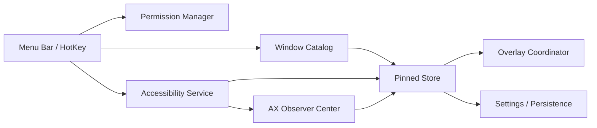

# DeskPins for macOS 项目书 v2

> 本文档是基于现有研究稿 [deskpins-trying-on-mac.md](/Users/lzc/Documents/科研/deskpins尝试/deskpins-trying-on-mac.md) 的重写版。
> 目标不是重复“所有调研细节”，而是产出一份可以直接指导后续 MCP 协作、产品收敛、工程实施与验收的落地总纲。

## 1. 文档目标

这份项目书解决四件事：

- 明确产品要做成什么，不做什么。
- 明确技术路线，尤其是公开 API 路线与高风险路线的边界。
- 明确 Codex + MCP 在本项目中的协作方式。
- 明确 MVP、里程碑、验收标准与后续扩展顺序。

本文档默认服务于“先做可维护、可迭代、可验证的 macOS 原生工具”，而不是一开始追求最极致但高风险的系统级黑科技方案。

## 2. 项目定义

### 2.1 项目一句话

做一个面向 macOS 的 DeskPins 风格窗口置顶工具，让用户可以用尽可能轻量、可解释、低学习成本的方式，把任意工作窗口固定在前景并持续管理。

### 2.2 产品定位

产品定位不是“大而全的 macOS 效率套件”，而是“专注窗口置顶体验的轻量工具”。

核心价值在于：

- 比通用自动化工具更快进入 pin/unpin 流程。
- 比脚本方案更稳定、可视化、可配置。
- 比注入式增强方案更适合长期维护与分发。

### 2.3 目标用户

- 知识工作者：会议窗口、任务列表、参考文档、翻译窗口常驻。
- 开发者与研究者：终端、规范、Issue、设计稿常驻。
- 创作者与运营：聊天面板、监控面板、素材参考窗常驻。

## 3. 最终结论

### 3.1 产品路线结论

本项目采用“公开 API 优先”的主路线：

- 用 Accessibility API 获取焦点窗口、窗口属性与变化通知。
- 用 `CGWindowListCopyWindowInfo` 构建窗口目录、搜索与点击命中能力。
- 用自家 `NSPanel` / `NSWindow` 浮层实现置顶视觉层、pin 徽标、边框与辅助交互。
- 把“原第三方窗口真的永远在最上层”视为增强目标，而不是 MVP 承诺。

这条路线的好处是：

- 可以做出非常接近 DeskPins 的使用体验。
- 技术边界清晰，便于后续持续维护。
- 更符合 Apple 对公开 API、当前正式系统兼容性和沙箱行为的要求。

### 3.2 商业与分发结论

首版应按“独立分发 + 签名/公证友好”去设计，而不是默认以 App Store 为唯一分发目标。

原因：

- 项目需要辅助功能权限。
- 如果未来引入更强的窗口内容预览，还会触碰屏幕录制权限。
- Apple 审核明确要求应用只使用公开 API，并运行在当前正式系统上。

这意味着：

- 首版必须避免私有 API。
- 必须把权限说明、失败降级与退出机制设计清楚。
- 需要从第一天就把“可解释的权限模型”当成产品设计的一部分。

## 4. 平台事实与边界

以下内容是这次重写时重新核对过的一手资料结论。

### 4.1 已确认的平台事实

- `AXIsProcessTrustedWithOptions` 是 macOS 判断辅助功能信任状态的官方入口，DeskPins 类工具几乎不可避免会用到它。
- `AXUIElement` 系列接口用于与可访问应用交互，适合获取焦点窗口、窗口属性和发起窗口级动作。
- `CGWindowListCopyWindowInfo` 是公开的窗口信息枚举入口，适合做窗口列表、搜索、点击命中和基础窗口识别。
- `NSWindow.CollectionBehaviorFullScreenAuxiliary` 的官方含义是：该窗口可以和全屏主窗口出现在同一个 Space。
- `ScreenCaptureKit` 可以在获得授权后枚举和捕获可共享窗口，适合第二阶段的“窗口内容预览/镜像”能力。
- Apple 当前支持文档在 2026 年 2 月仍明确把 `macOS Tahoe 26.3` 列为最新主线版本，因此实现和测试要面向当前正式系统，而不是只对旧版经验成立。

### 4.2 明确的技术边界

- `AXRaise` 一类能力更接近“尽量前置窗口”，不等同于把别家窗口永久提升为系统级最高层。
- 公开 API 路线可以稳定管理“我们的浮层窗口”的层级，但无法保证任意第三方窗口在所有场景下都获得 Windows DeskPins 式的绝对语义。
- 如果追求强一致“真置顶”，通常会逼近私有 API、注入、甚至系统保护边界，不应纳入 MVP。

### 4.3 明确不采用的高风险路线

- 私有 API 改 WindowServer 层级。
- 注入 Dock 或目标应用进程。
- 依赖关闭 SIP 的功能设计。
- 默认开启屏幕内容捕获。

## 5. 产品需求重构

### 5.1 用户真正购买的是哪种能力

用户要的不是“研究一套 macOS 窗口学”，而是下面这几个结果：

- 我能很快 pin 当前窗口。
- 我能看得出哪些窗口已经 pinned。
- 我能同时管理多个 pinned 窗口。
- 我能预期哪个 pinned 窗口会在最上面。
- 权限不给时，应用能说清楚为什么不能工作。

### 5.2 MVP 必须具备

- Pin/Unpin 当前焦点窗口。
- 从窗口列表中选择任意可见窗口进行 Pin/Unpin。
- 同时管理多个 pinned 窗口。
- 清晰的 pin 状态表达。
- 菜单栏入口。
- 全局快捷键。
- “最近 pin”或“最近交互”的 pinned 顺序规则。
- 权限不足、窗口失效、目标应用退出时的降级提示。

### 5.3 MVP 明确不做

- 不承诺所有第三方窗口都能成为真正系统级最高层。
- 不做复杂规则引擎。
- 不做窗口内容镜像。
- 不做同步服务、账户系统、云配置。
- 不做 App Store 首发前提。

## 6. 交互设计定稿

### 6.1 主入口

首版采用菜单栏常驻应用形态。

主入口包括：

- `Pin Current Window`
- `Window List`
- `Pinned Windows`
- `Unpin All`
- `Settings`
- `Permissions`

### 6.2 核心交互流

#### 流程 A：Pin 当前窗口

1. 用户通过快捷键或菜单栏触发 `Pin Current Window`。
2. 应用检查 Accessibility 授权状态。
3. 若未授权，跳转说明与系统设置引导。
4. 若已授权，读取当前焦点窗口。
5. 写入 pinned store。
6. 创建或刷新 pin 徽标与边框浮层。
7. 应用 z-order 规则。

#### 流程 B：从列表选择窗口

1. 用户打开窗口列表。
2. 应用通过 `CGWindowListCopyWindowInfo` 刷新可见窗口目录。
3. 用户搜索或筛选应用与窗口标题。
4. 用户点选后执行 Pin。
5. 应用尝试将其纳入 observer 与 pinned store。

#### 流程 C：管理 pinned

对每个 pinned 项支持：

- Focus
- Unpin
- Toggle click-through
- 调整透明度
- 查看状态异常

### 6.3 顺序规则

首版保留一个简单但必须可解释的策略：

- 默认采用“最近交互的 pinned 浮层在上”。
- 在未发生交互前，使用“最近 pin 在上”。
- 设置页提供切换开关，让用户改成“最近 pin 永远优先”。

## 7. 技术方案定稿

### 7.1 架构原则

- 先把“窗口识别”和“浮层展示”分开。
- 先把“数据状态”和“系统事件”分开。
- 先把“公开 API 可稳定完成的事”做好，再评估增强路线。

### 7.2 模块划分

- `App`
  - 启动、状态栏、设置页、权限入口。
- `Permissions`
  - Accessibility 与未来可能引入的 Screen Recording 状态管理。
- `WindowCatalog`
  - 枚举窗口、过滤、搜索、命中测试、基础窗口标识。
- `Accessibility`
  - 聚焦窗口获取、属性读取、observer 与窗口动作。
- `Pinned`
  - pinned model、排序规则、持久化、异常状态。
- `Overlay`
  - pin 徽标、边框、浮层层级、点击穿透、透明度。
- `HotKey`
  - 全局快捷键注册与冲突提示。

### 7.3 模块关系图



### 7.4 窗口识别策略

首版窗口识别采用“多因子弱标识”，而不是假设存在完美稳定的全局唯一键。

建议组合字段：

- `ownerPID`
- `windowTitle`
- `bounds`
- `CGWindowNumber`
- 最近一次观测时间

设计原因：

- 仅依赖标题不稳。
- 仅依赖 bounds 不稳。
- 仅依赖窗口号也不该被视为跨生命周期的强承诺。

### 7.5 事件策略

首版采用“通知优先，轮询兜底”。

- 通知来源：焦点变化、窗口移动、窗口尺寸变化、销毁等。
- 轮询范围：只针对 pinned 窗口。
- 轮询目标：位置、尺寸、可见性和关联有效性。

这样做的目的是：

- 避免全局高频扫描。
- 避免把所有可靠性压在某个通知是否足够及时上。

### 7.6 权限模型

首版默认只要求：

- Accessibility

第二阶段按需增加：

- Screen Recording

原则是：

- 没有内容预览，就不请求录屏权限。
- 没有必要，就不引入更重权限。

## 8. MCP 协作方案

### 8.1 当前推荐 MCP 角色分工

本项目当前优先使用如下 MCP 组合：

- `filesystem`
  - 读写项目文档、架构说明、计划、脚本和源码。
- `git`
  - 读取提交历史、比较方案差异、组织小步提交。
- `fetch`
  - 抓取 Apple 文档、GitHub README、issue、博客资料。
- `openaiDeveloperDocs`
  - 查询 Codex、MCP、OpenAI 工具接入文档。
- `github`
  - 后续如需 issue/PR/roadmap 管理时使用。
- `context7`
  - 在进入具体 Swift 库和框架实现时补充文档检索。

### 8.2 在本项目里的实际工作方式

MCP 不直接替代工程设计，它负责提升“资料可信度”和“执行效率”。

具体使用方式：

- 需求和项目书阶段：`filesystem + fetch + openaiDeveloperDocs`
- 代码实现阶段：`filesystem + git + context7`
- 协作管理阶段：`git + github`
- 后续接入 Xcode 专项能力阶段：评估 `XCF`

### 8.3 MCP 使用原则

- 先官方源，再第三方源。
- 先读文档与边界，再写代码。
- 先收敛方案，再扩大工具集合。
- 所有外部资料结论必须落回项目文档，而不是只停留在对话里。

### 8.4 对 XCF 的态度

`XCF` 很适合等 Xcode 工程成型后再接入。

原因：

- 它更偏“Swift/Xcode 实施增益工具”。
- 当前仓库仍处在项目规划阶段。
- 太早接入 XCF，对当前收益不如通用 MCP 高。

因此，XCF 被定义为“工程启动后的增强项”，不是本轮前置条件。

## 9. 仓库结构建议

建议在真正开始实现前，把仓库整理成下面的结构：

```text
Docs/
  product-spec.md
  architecture.md
  permission-model.md
  mvp-checklist.md
  release-plan.md
App/
Core/
  Accessibility/
  WindowCatalog/
  Overlay/
  Pinned/
  HotKey/
Scripts/
  build.sh
  test_ax.sh
  lint.sh
AGENTS.md
```

说明：

- `Docs/` 负责沉淀稳定知识，而不是把关键信息散落在聊天记录里。
- `Scripts/` 负责把手工验证动作脚本化。
- `Core/` 的拆分直接对应本文第 7 节模块划分。

## 10. MVP 实施计划

### 10.1 Phase 0：工程与规则准备

目标：

- 建立目录结构。
- 固化项目文档。
- 建立最小脚本与日志方案。
- 定义 AGENTS 约束和提交规则。

交付物：

- 项目目录骨架
- `Docs/` 初始文档
- 基础脚本

### 10.2 Phase 1：菜单栏与权限基础

目标：

- 建立可运行的菜单栏 App。
- 能检测与引导 Accessibility 权限。
- 有基础设置页和状态表达。

交付物：

- 菜单栏图标与基础菜单
- 权限状态页面
- 启动与异常日志

### 10.3 Phase 2：Pin 当前窗口

目标：

- 获取当前焦点窗口。
- 执行 Pin/Unpin。
- 建立 pinned store。

交付物：

- `Pin Current Window`
- `Unpin Current Window`
- pinned 数据模型

### 10.4 Phase 3：浮层与视觉反馈

目标：

- 给 pinned 项生成稳定的边框或 pin 徽标。
- 建立浮层层级控制。
- 引入最近 pin / 最近交互排序。

交付物：

- Overlay coordinator
- pin badge
- z-order 策略

### 10.5 Phase 4：窗口列表与搜索

目标：

- 构建窗口目录。
- 支持按应用名与标题搜索。
- 支持从列表 pin 任意窗口。

交付物：

- Window list UI
- 过滤策略
- 点击列表 pin 流程

### 10.6 Phase 5：稳定性与回归

目标：

- 验证多显示器、Space、全屏、应用退出、窗口重建等场景。
- 补充失败提示和恢复策略。
- 为下一阶段增强能力做技术预埋。

交付物：

- 兼容性报告
- 风险清单
- 发布前检查表

## 11. 验收标准

### 11.1 功能验收

- 用户能在授权后稳定 pin 当前窗口。
- 用户能从窗口列表 pin 非当前窗口。
- 同时 pinned 3 到 5 个窗口时，状态可识别、可管理、可取消。
- 置顶规则对用户是可解释的。
- 目标窗口关闭或应用退出时，不崩溃。

### 11.2 体验验收

- 首次启动时，权限需求讲得清楚。
- 菜单栏操作不超过 2 次点击进入主要功能。
- 快捷键注册失败时有可理解提示。
- 异常状态不出现“看起来像坏了但不知道为什么”的情况。

### 11.3 工程验收

- 核心模块边界清晰。
- 文档与代码结构一致。
- 所有关键行为都有最少一条验证路径。
- 没有任何私有 API 依赖进入主线设计。

## 12. 风险清单

### 12.1 技术风险

- 焦点窗口与窗口目录映射不总是完美。
- 某些应用的 Accessibility 支持质量参差不齐。
- 全屏与多 Space 下的行为可能需要更多降级逻辑。
- `RegisterEventHotKey` 在较新系统上存在组合键限制，例如 Apple 开发者论坛中已明确说明：仅使用 `Shift` 和 `Option` 的组合不再被接受，至少要包含一个非 `Shift` / `Option` 的修饰键。

### 12.2 产品风险

- 用户可能把“DeskPins”理解成 Windows 上那种绝对系统级语义。
- 如果不在产品文案里说清楚，会导致预期落差。

### 12.3 应对策略

- 首版文案明确写“DeskPins-style”而不是“完全等价 DeskPins”。
- 在设置页和帮助文档里解释权限与限制。
- 把增强路线留给后续版本，而不是首版承诺。

## 13. 第二阶段扩展路线

以下内容不进 MVP，但值得保留为路线图：

- 窗口内容预览或镜像
- App Intents / Shortcuts
- 自动 pin 规则
- 分组与场景模板
- XCF 接入
- 高级窗口识别与诊断面板

## 14. 本项目下一步建议

在本文档确认后，建议严格按下面顺序推进：

1. 把本文档作为新的项目总纲保留。
2. 从中拆出 `Docs/product-spec.md`、`Docs/architecture.md`、`Docs/mvp-checklist.md`。
3. 建立项目目录骨架和 AGENTS 约束。
4. 再进入第一轮实现。

如果跳过第 2 步和第 3 步，后面很容易在“边做边想”中再次发散。

## 15. 参考资料

以下链接是本次重写时重点参考并重新核对过的资料：

- Apple Developer: `AXUIElement.h`
  - https://developer.apple.com/documentation/applicationservices/axuielement_h
- Apple Developer: `CGWindowListCopyWindowInfo`
  - https://developer.apple.com/documentation/coregraphics/1455137-cgwindowlistcopywindowinfo
- Apple Developer Archive: Full-Screen Experience
  - https://developer.apple.com/library/archive/documentation/General/Conceptual/MOSXAppProgrammingGuide/FullScreenApp/FullScreenApp.html
- Apple Developer: `ScreenCaptureKit`
  - https://developer.apple.com/documentation/screencapturekit
- Apple Developer: App Review Guidelines
  - https://developer.apple.com/app-store/review/guidelines/
- Apple Support: Latest macOS versions
  - https://support.apple.com/en-us/109033
- OpenAI Docs MCP
  - https://platform.openai.com/docs/docs-mcp
- OpenAI MCP Guide
  - https://platform.openai.com/docs/mcp/
- Apple Developer Forums: `RegisterEventHotKey` modifier restriction
  - https://developer.apple.com/forums/thread/763878
- MCP reference servers
  - https://github.com/modelcontextprotocol/servers
- XCF Xcode MCP Server
  - https://github.com/CodeFreezeAI/xcf

## 16. 附注

这份 v2 文档保留了旧稿的核心判断，但做了三处关键调整：

- 从“研究报告体”改成“实施总纲体”。
- 把 MCP 协作方式正式纳入项目设计。
- 把首版边界讲得更硬，避免后续实现阶段持续被“真系统级置顶”牵着跑。
