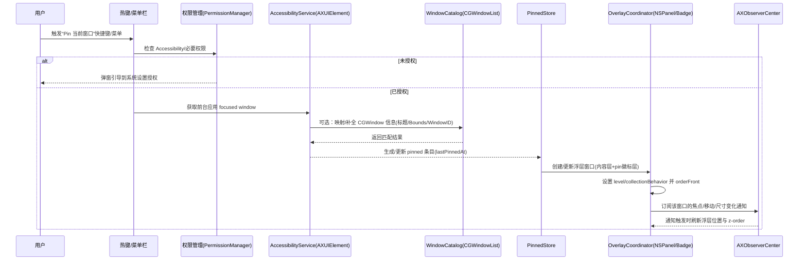

# macOS 实现 DeskPins 式窗口置顶工具的初步设计与使用方案研究

## 执行摘要

本研究面向“在 macOS 上实现类似 Windows DeskPins 的窗口置顶（pin）工具”的目标，给出可执行的初步产品设计、技术路线、交互方案与开发计划。核心结论是：**用纯公开 API（Accessibility/AXUIElement + CoreGraphics/CGWindowList）可以做出“稳定、可分发、接近 DeskPins 体验”的置顶工具，但很难百分之百复刻 Windows 上对任意第三方窗口的“真正交互式系统级置顶”**；若追求强一致性的系统级置顶（跨应用、跨 Space/全屏、保持原窗口可交互且不被系统重新分层），通常会涉及**私有 API**或**代码注入/修改系统行为**，这会显著提高兼容性与上架风险，并可能牵涉 SIP（System Integrity Protection）相关限制。citeturn10view0turn6search1turn4search16turn5search8

建议采用“双轨设计”：

- **公开 API 路线（推荐、可长期维护）**：以 Accessibility 获取窗口身份/位置/尺寸/焦点变化；用 CGWindowListCopyWindowInfo 枚举窗口与构建“窗口列表与搜索”；通过自家浮层窗口（NSPanel/NSWindow）实现“置顶层级、可视化 pin 图标、菜单栏管理、全局快捷键、多窗口置顶与最近交互置顶规则”。此路线可做到**多数场景下的 deskpins-like 体验**，并能以较低风险走签名/公证（notarization）甚至尝试 App Store（取决于权限要求与实现细节）。citeturn0search2turn7search1turn14search3turn10view0  
- **增强路线（不建议作为首发 MVP）**：若目标是“把*原第三方窗口*的 WindowServer 层级/属性直接改成置顶”，往往需要私有框架（例如 SkyLight/CGS 系列）或注入技术；这类做法可能随系统更新破坏，并与“仅使用公开 API”的审核要求冲突。citeturn10view0turn6search0turn5search8turn4search16

在平台与版本背景上，截至 2026 年 3 月，Apple 官方渠道显示 macOS 主线为 **macOS Tahoe 26**，并持续发布 26.x 更新；因此任何面向大众分发的工具，需要至少在“当前出货系统”上验证并持续适配。citeturn15search6turn15search3

下文给出：目标用户与场景、必备功能清单与非功能需求、技术实现细节（含关键 API 与风险）、“最近 pin/最近点击”置顶规则的 z-order 策略、失败与降级、完整 UI/UX 流程、分周里程碑与工时估算、测试方案与限制、以及与 BetterTouchTool/Floaty/AfloatX/Helium 的对比表与扩展建议。

## 需求与范围

### 目标用户与使用场景

目标用户可分为三类：

第一类是**知识工作者与学生**：写作/阅读/编码时需要一个“参考窗”常驻，例如：会议窗口、任务清单、PDF 规范、对照表、翻译词典。此类需求强调“随手 pin、可多窗口、轻量不打扰”。（典型场景在第三方置顶工具的用户指南中也被频繁提及，例如会议、笔记、教程对照等。）citeturn8view2

第二类是**创作者与运营**：需要常驻监控窗口（聊天、仪表盘、素材库），偏好“置顶 + 透明度 + 点击穿透”。citeturn8view2turn8view3

第三类是**重度效率工具用户/工程师**：希望通过快捷键、脚本与规则自动 pin（按应用、按窗口标题/URL），并与 Raycast/Shortcuts/AppleScript 联动。citeturn3search17turn8view2

### “类似 DeskPins”在 macOS 上的定义边界

为了让需求可落地，需要把“DeskPins 式体验”拆成可验证的子目标：

- **交互层面**：提供“选择窗口 → 📌 钉住 → 置顶显示 → 随时取消”的一致流程。
- **窗口层面**：支持多个 pinned 窗口；提供“最近 pin/最近点击的 pinned 窗口在最上”的规则；在 Space/全屏/多显示器下尽量稳定。
- **系统层面**：需要辅助功能权限（Accessibility）几乎不可避免，因为必须读取并跟踪外部应用窗口信息并进行控制。Apple 官方也明确提示：授权辅助功能应用等同于给予其访问你 Mac 上多类信息的能力，必须谨慎授予。citeturn8view7

## 技术路线与可行性评估

### 关键平台事实与限制

- **仅用 Accessibility “抬高”窗口并不等价于“系统级永远置顶”**：kAXRaiseAction 的含义是将窗口尽可能置前，但它“能到多前”受应用与系统情境约束（文档表述为 *as frontmost as is allowed*）。这意味着它更接近“把窗口带到前台/聚焦”，而不是“强行把一个非本进程窗口提升到更高 Window Level”。citeturn11search2turn16search17  
- **窗口枚举与顺序**：CGWindowListCopyWindowInfo 可以获得当前用户会话中窗口的信息；当使用 on-screen 选项时，窗口列表按“从前到后”返回（可用于判断点击点下的最前窗口与构建窗口列表）。citeturn0search2turn0search6  
- **私有 API 与注入路线的风险**：App Review Guidelines 明确要求 App “只能使用公开 API”。此外，SIP 的存在旨在阻止未授权代码执行与保护系统关键组件；而像 yabai 这类窗口管理工具在需要“更底层控制窗口管理器”时，会走“注入到系统组件（如 Dock）”的路径，并因此与 SIP 限制纠缠。citeturn10view0turn6search0turn6search1turn5search8

### 实现方案评分表

评分说明：1–5 分。**可行性/稳定性/兼容性**：5 分最好；**上架风险**：1 低、5 高。

| 方案 | 核心思路 | 可行性 | 稳定性 | 兼容性 | 上架风险 |
|---|---|---:|---:|---:|---:|
| Accessibility API（AXUIElement/AXObserver） | 以辅助功能获取窗口/监听变化/执行 raise、移动缩放等；置顶主要依赖自家浮层窗口实现 | 2 | 4 | 3 | 1 |
| CGWindow “注入”（更准确说：CGWindow 枚举 + 自家浮层叠加） | 用 CGWindowListCopyWindowInfo 枚举与命中；必要时用屏幕/窗口捕获做“视觉置顶”；真实置顶由自家 NSPanel/overlay 实现 | 4 | 3 | 3 | 2 |
| 私有 API / 注入（SkyLight/CGS、SIMBL、Dock 注入等） | 直接改 WindowServer 层级/行为或注入目标应用以调用内部机制，实现“真正置顶外部窗口” | 5 | 1 | 2 | 5 |

支撑依据：公开 API 的窗口枚举与顺序依赖 CoreGraphics 文档；私有 API 与注入会触碰“仅公开 API”的审核要求，并与 SIP 的系统保护目标冲突。citeturn0search2turn0search6turn10view0turn6search1turn4search16turn5search8

### 推荐路线结论

本报告后续设计以**“公开 API 路线 + 可选增强”**为主，理由是：

- 可以明确列出所需权限与隐私边界，符合 Apple 对辅助功能应用“谨慎授权”的用户教育方向。citeturn8view7  
- 维护成本可控：不依赖随系统更新易断裂的私有接口。citeturn6search0turn10view0  
- 产品体验可通过“置顶叠加层 + 最近交互排序 + 快捷键/菜单栏/搜索”逼近 DeskPins 的效率核心，而不必一开始追求系统级强置顶。

## 核心功能设计与交互方案

### 核心功能清单

以下清单按“必须具备”组织（与你提出的约束逐项对齐），并给出实现要点。

**pin / unpin**
- 对“当前聚焦窗口”一键 pin/unpin（快捷键与菜单项）。聚焦窗口可通过 kAXFocusedWindowAttribute 获取。citeturn7search1  
- 对“窗口列表中的任意窗口” pin/unpin（列表选择后 pin）。列表建立依赖 CGWindowListCopyWindowInfo 及窗口列表必备键（OwnerPID/Bounds/Name/Number 等）。citeturn0search2turn19search7turn19search0turn19search3turn13search0

**支持多个 pinned 窗口**
- pinned 列表结构化存储（内存 + 持久化），每个 pinned 项包含：窗口身份（pid + 近似匹配特征）、标题、bounds、最近 pin 时间、最近激活时间、模式（是否点击穿透/透明度/锁定大小）。  
- 需要“失效重连”机制：目标应用退出重启、窗口被关闭/重建时，自动标记并提示。

**最近 pin / 最近点击置顶规则**
- 最近 pin：新 pin 的窗口永远位于 pinned 队列最上方；应用时对浮层窗口按队列顺序重新 order，使新 pin 的浮层最后 orderFront。  
- 最近点击：当用户点击某 pinned 窗口（或其 pin 徽标），更新 lastActivatedAt，并重新排序应用。焦点变化可通过 Accessibility 通知（例如 focused window changed）辅助判断。citeturn14search11turn14search3turn0search6

**全局快捷键**
- 推荐 Carbon 的 RegisterEventHotKey 注册全局快捷键（无需监听所有键盘事件，仅注册特定组合键）。行业实践与讨论中，该方式长期被用于 macOS 全局快捷键；且 WWDC 相关资料指出其在 64-bit 可用。citeturn3search11turn2search20turn3search7  
- 也可提供“用户自定义快捷键”UI（偏好设置页）。

**菜单栏管理**
- 菜单栏图标（NSStatusItem）提供核心动作：Pin 当前窗口、进入“选择窗口📌模式”、打开窗口列表、管理 pinned、设置。  
- pinned 状态在菜单栏菜单中可见（例如以 ✅/📌 标注）。

**窗口列表与搜索**
- 以 CGWindowListCopyWindowInfo 构建“当前可见窗口库”，并用 kCGWindowOwnerName/kCGWindowName/kCGWindowBounds/kCGWindowNumber/kCGWindowOwnerPID 等字段展示与搜索。citeturn0search2turn19search1turn19search2turn19search3turn13search0turn19search0  
- 需要过滤“非标准窗口层级/系统 UI window”：实践中 CGWindow 列表包含大量系统元素（Dock、菜单栏等），通常需要基于 kCGWindowLayer、OwnerName、Bounds 等过滤出用户关心的“标准层级窗口”。citeturn11search14turn19search7

**可视化 pin 图标/状态**
- 在被 pin 的窗口附近绘制 pin badge：推荐用**两个浮层窗口**实现（一个用于显示内容/边框，一个用于只承载可点击的 pin 徽标），以同时支持“点击穿透内容区域 + 徽标可交互”。  
- 提供边框高亮（类似“pinned window 有边框”），以及可选透明度与 click-through（点穿透）能力（参考 Helium 的透明+不拦截点击思路）。citeturn8view3turn8view2

### UI/UX 交互流程

#### 菜单栏模式
- 点击菜单栏图标 → 显示：  
  - **Pin/Unpin 当前窗口**（同快捷键）  
  - **📌 选择窗口模式**（进入全屏轻量遮罩，下一次点击决定要 pin 的窗口）  
  - **Pinned 列表**（支持搜索、排序、对每项：Focus、Unpin、Toggle Click-through、Opacity、锁定大小/位置）  
  - 设置与权限状态（Accessibility/屏幕录制）

#### 拖拽 pin（DeskPins 风格）
- 进入“📌选择窗口模式”后：  
  - 鼠标呈现 pin 光标（或屏幕中心出现 pin 图标可拖拽）  
  - 用户拖拽/点击落点 → 应用以该点为采样，计算该点下“最前窗口”并 pin  
  - 视觉反馈：目标窗口边框闪烁一次 + pin 徽标出现  
- 命中逻辑建议用：窗口列表“前到后”的顺序 + bounds 包含点的判断（先命中最前窗）。citeturn0search6turn19search3

#### 右键菜单
- 对 pinned 徽标右键：Unpin、置顶模式（最近点击规则开关）、透明度、点击穿透、锁定位置、加入分组等。

#### 快捷键交互
- 全局快捷键：Pin/Unpin 当前窗口  
- 组合快捷键：循环切换 pinned（按 lastActivatedAt）、临时“将 pinned 置底 10 秒”、一键取消全部 pinned

## 窗口层级与 z-order 管理策略

### 置顶的“层级”和“顺序”分开处理

在 macOS 窗口模型中，“Window Level（层级）”决定不同层之间的遮挡优先级；同层内再按 z-order 排序。Apple 文档对 NSWindow.Level 的描述强调：**层级之间的堆叠优先于层内顺序**（即低层级的最上窗也会被高层级的最下窗遮挡）。citeturn11search1turn0search3

因此，设计上把问题拆成两步：

- **Pinned 层级**：所有 pinned 浮层统一设为 floating/overlay 级别（对自家窗口可控），确保其盖过普通应用窗口。CGWindowLevelKey 体系中存在 floatingWindow 等标准层级键。citeturn0search3turn11search1  
- **Pinned 内部顺序**：在 pinned 浮层之间使用 orderFront / orderFrontRegardless 等方法按“从旧到新”重排，使“最新交互/最新 pin”的那一个最后 orderFront，从而处于最上。

### “最近 pin / 最近点击在上”的实现策略

建议维护两个时间戳：

- `lastPinnedAt`：pin 操作触发时更新
- `lastActivatedAt`：用户点击 pinned 徽标、或系统检测到该窗口成为 focused window 时更新（可通过 focused window changed 通知 + 映射判断）。citeturn14search11turn14search3turn7search1

排序规则：

- 默认使用 `lastActivatedAt`；若窗口从未激活过，则退化用 `lastPinnedAt`
- “最近 pin 优先”可作为开关：开启时 `lastPinnedAt` 优先于 `lastActivatedAt`（适合只把 pinned 当作参考窗，不希望点击改变叠放）

应用顺序：

- 将 pinned 浮层按“旧 → 新”顺序依次 `orderFront`，保证最后一个在最上。

### 事件驱动与轮询混合

仅靠通知可能不足，因为某些通知是“操作结束后”才发，例如 kAXWindowMovedNotification 明确说明它在窗口移动结束时发送，而非持续发送；社区也指出难以用它获得连续移动事件。citeturn14search2turn14search9turn14search16

推荐混合策略：

- **事件驱动**：对 pinned 窗口所在应用建立 AXObserver，监听：focused window changed、window moved/resized/miniaturized、UI destroyed 等（按 pinned 规模动态订阅），减少全局开销。citeturn14search3turn0search5turn14search11  
- **轻量轮询降级**：当通知缺失或目标应用不响应时，以 5–10 Hz 轮询 pinned 窗口的 position/size（仅对可见 pinned 项），保证浮层跟随位置。

### 失败场景与降级策略

**权限缺失**
- 未授予 Accessibility：无法获取 focused window、无法读取外部窗口属性/订阅通知 → 降级为“只能显示窗口列表（CGWindow）+ 引导授权”。Apple 官方支持文档明确说明需在“隐私与安全性→辅助功能”中授权，并提醒谨慎授予。citeturn8view7

**目标应用不响应 / AX 操作超时**
- AXUIElementPerformAction/CopyAttributeValue 可能出现 kAXErrorCannotComplete。旧版文档建议：遇到 cannot complete 时可重试或调整消息超时。citeturn16search10turn16search3  
- 降级：临时仅保持“静态边框+pin 徽标”，不做实时跟随；或提示“该窗口暂不可管理”。

**全屏/Space 行为不符合预期**
- pinned 浮层要跨 Space 或出现在全屏应用之上，需要设置 collectionBehavior（例如 canJoinAllSpaces、fullScreenAuxiliary 等）。Apple 开发者论坛讨论指出：理论上应包含 canJoinAllSpaces 与 fullScreenAuxiliary，但实际仍可能受窗口类型/层级选择影响；并建议避免 MaximumWindowLevelKey，使用 Floating/Overlay 更合适。citeturn17view0turn16search0turn16search1  
- 降级：当检测到全屏 Space 时，提示用户“该全屏场景下仅保证同 Space 内置顶”；或开启“仅在当前 Space 固定”模式。

**DRM/受保护内容**
- 某些方案（例如“浮动预览/镜像”）对 DRM 视频可能失效或显示黑屏；用户社区对现成工具亦有类似反馈。citeturn4search9  
- 降级：显示边框与占位提示，不显示内容；或建议使用目标应用自带 PIP/置顶能力（若存在）。

## 技术实现细节与项目骨架

### 推荐语言与框架

- 语言：Swift（便于与 AppKit/AX C API 桥接）
- UI：AppKit 为主（菜单栏、NSPanel、窗口层级控制），可选 SwiftUI 做设置页
- 关键系统 API：
  - Accessibility：AXUIElementCreateApplication、kAXWindowsAttribute/kAXFocusedWindowAttribute、AXObserverCreate/AXObserverAddNotification 等citeturn11search19turn7search0turn7search1turn0search5turn14search3
  - 窗口枚举：CGWindowListCopyWindowInfo + required/optional window list keys（OwnerPID/Bounds/Name/Number 等）citeturn0search2turn19search7turn19search0turn19search3turn13search0
  - 置顶浮层：NSWindow.Level / CGWindowLevelKey（floatingWindow 等）citeturn11search1turn0search3
  - Space/全屏：NSWindow.CollectionBehavior（canJoinAllSpaces、fullScreenAuxiliary）citeturn16search0turn16search1turn17view0
  - 全局快捷键：RegisterEventHotKey（Carbon）citeturn3search11turn2search20

### Mermaid 流程图：一次 pin 的关键步骤



### Swift 项目骨架建议

以下骨架以“菜单栏常驻工具 + 浮层置顶”组织，确保模块职责清晰、便于测试与替换实现。

- `App/PinItApp.swift`  
  入口（SwiftUI App 或 NSApplicationMain），初始化依赖容器、启动菜单栏。
- `App/AppDelegate.swift`  
  创建 `NSStatusItem`，注册热键，处理唤起设置页等。
- `Permissions/PermissionManager.swift`  
  检查/请求 Accessibility（AXIsProcessTrustedWithOptions）、（可选）屏幕录制权限提示文案与状态。
- `WindowCatalog/WindowCatalog.swift`  
  使用 `CGWindowListCopyWindowInfo` 拉取窗口列表；实现过滤、排序、搜索、point-hit-test（根据 bounds 命中点击点）。citeturn0search2turn0search6turn19search3
- `Accessibility/AccessibilityService.swift`  
  封装 AXUIElement：获取 frontmost app、focused window、读取 title/position/size、执行 raise 等。citeturn7search1turn7search5turn11search2
- `Accessibility/AXObserverCenter.swift`  
  为 pinned 相关应用创建 observer；订阅 focused window changed、window moved/resized 等通知；在回调中更新 pinned。citeturn0search5turn14search3turn14search11
- `Pinned/PinnedWindow.swift`  
  数据模型：pid、窗口特征、状态（pin 模式/透明度/点击穿透）、时间戳。
- `Pinned/PinnedStore.swift`  
  状态仓库：增删改查、持久化、排序（lastActivatedAt/lastPinnedAt）、发布变更供 UI 订阅。
- `Overlay/OverlayCoordinator.swift`  
  把 pinned 条目映射到具体浮层窗口控制器；负责 z-order 应用与跟随窗口移动。
- `Overlay/ContentOverlayWindowController.swift`  
  主浮层（显示边框/阴影/可选内容镜像）。
- `Overlay/PinBadgeWindowController.swift`  
  小型可点击徽标浮层（承载 pin 图标、右键菜单），可与内容浮层分离以支持点击穿透。
- `HotKey/HotKeyManager.swift`  
  RegisterEventHotKey 注册/注销与事件分发。citeturn2search20turn3search11
- `UI/StatusMenuBuilder.swift`  
  生成菜单栏菜单（含搜索窗口 popover）。
- `UI/SettingsWindowController.swift`  
  设置：快捷键、默认透明度、是否“最近点击置顶”、分组规则等。

### 关键代码片段示例

下面代码以“公开 API 路线”的可执行片段为目标：**用 Accessibility 获取窗口并执行 raise（提升到尽可能靠前）**，以及**把自家浮层窗口提升到 floating level**，并实现**全局快捷键**与**pinned 列表排序**。

#### 用 Accessibility 获取 focused window 并执行 “raise”

```swift
import AppKit
import ApplicationServices

final class AccessibilityService {
    func frontmostFocusedWindow() -> AXUIElement? {
        guard let app = NSWorkspace.shared.frontmostApplication else { return nil }

        let appAX = AXUIElementCreateApplication(app.processIdentifier)
        var focused: CFTypeRef?
        let err = AXUIElementCopyAttributeValue(appAX,
                                               kAXFocusedWindowAttribute as CFString,
                                               &focused)
        guard err == .success, let window = focused else { return nil }
        return (window as! AXUIElement)
    }

    func windowFrame(_ window: AXUIElement) -> CGRect? {
        var posRef: CFTypeRef?
        var sizeRef: CFTypeRef?

        guard AXUIElementCopyAttributeValue(window, kAXPositionAttribute as CFString, &posRef) == .success,
              AXUIElementCopyAttributeValue(window, kAXSizeAttribute as CFString, &sizeRef) == .success,
              let posVal = posRef as? AXValue,
              let sizeVal = sizeRef as? AXValue
        else { return nil }

        var pos = CGPoint.zero
        var size = CGSize.zero
        AXValueGetValue(posVal, .cgPoint, &pos)
        AXValueGetValue(sizeVal, .cgSize, &size)
        return CGRect(origin: pos, size: size)
    }

    func raiseWindow(_ window: AXUIElement) {
        // 尝试让窗口成为 main（不一定成功，取决于目标应用/窗口属性）
        _ = AXUIElementSetAttributeValue(window,
                                        kAXMainAttribute as CFString,
                                        kCFBooleanTrue)

        // 请求“尽可能置前”
        _ = AXUIElementPerformAction(window, kAXRaiseAction as CFString)
    }
}
```

相关依据：focused window、position、main attribute、performAction/raiseAction 等均来自 Accessibility 体系的属性/动作定义；kAXPositionAttribute 指出坐标为全局屏幕坐标且 (0,0) 在屏幕左上角，这影响你如何把 AX 坐标转换为 AppKit window frame。citeturn7search1turn7search5turn7search4turn1search2turn1search3turn11search2

#### 把自家浮层窗口提升层级并跨 Space/全屏展示

```swift
import AppKit

final class OverlayWindowController: NSWindowController {
    init(frame: CGRect) {
        let panel = NSPanel(
            contentRect: frame,
            styleMask: [.borderless, .nonactivatingPanel],
            backing: .buffered,
            defer: false
        )
        panel.isOpaque = false
        panel.backgroundColor = .clear
        panel.hasShadow = true

        // 置顶层级（对自家窗口可控）
        panel.level = .floating

        // 跨 Space / 尝试贴在全屏 Space 上
        panel.collectionBehavior = [.canJoinAllSpaces, .fullScreenAuxiliary]
        panel.hidesOnDeactivate = false

        super.init(window: panel)
    }

    required init?(coder: NSCoder) { fatalError("init(coder:) has not been implemented") }
}
```

相关依据：canJoinAllSpaces/fullScreenAuxiliary 用于控制窗口在 Space/全屏下的展示特性；开发者论坛讨论也将其作为“希望跨 Space/全屏可见”的关键配置之一。citeturn16search0turn16search1turn17view0

#### 注册全局快捷键（RegisterEventHotKey）

```swift
import Carbon.HIToolbox

final class HotKeyManager {
    private var hotKeyRef: EventHotKeyRef?
    private var handlerRef: EventHandlerRef?

    // 示例：⌃⌥⌘P
    func registerPinHotKey(onTriggered: @escaping () -> Void) {
        // 安装事件处理器（简化写法：将闭包存到单例/全局中再在回调取出）
        var eventType = EventTypeSpec(eventClass: OSType(kEventClassKeyboard),
                                      eventKind: UInt32(kEventHotKeyPressed))

        InstallEventHandler(GetApplicationEventTarget(), { (_, event, _) -> OSStatus in
            var hkID = EventHotKeyID()
            GetEventParameter(event,
                              EventParamName(kEventParamDirectObject),
                              EventParamType(typeEventHotKeyID),
                              nil,
                              MemoryLayout<EventHotKeyID>.size,
                              nil,
                              &hkID)

            if hkID.id == 1 {
                onTriggered()
            }
            return noErr
        }, 1, &eventType, nil, &handlerRef)

        var hkID = EventHotKeyID(signature: OSType(0x50494E31), id: 1) // 'PIN1'
        let modifiers: UInt32 = UInt32(controlKey | optionKey | cmdKey)

        RegisterEventHotKey(UInt32(kVK_ANSI_P),
                            modifiers,
                            hkID,
                            GetApplicationEventTarget(),
                            0,
                            &hotKeyRef)
    }

    func unregister() {
        if let hotKeyRef { UnregisterEventHotKey(hotKeyRef) }
        hotKeyRef = nil
    }
}
```

相关依据：RegisterEventHotKey 是 macOS 上常见的全局快捷键注册方式之一；相关讨论与资料指出其在 64-bit 可用并常用于实现全局 hotkey。citeturn3search11turn2search20turn3search7

#### 维护 pinned 列表并按“最近 pin/最近点击”排序

```swift
import Foundation

struct PinnedWindow: Identifiable, Equatable, Codable {
    enum SortBasis: String, Codable { case lastActivatedThenPinned, lastPinned }

    let id: UUID
    let ownerPID: pid_t
    var title: String
    var axHint: AXHint

    var lastPinnedAt: Date
    var lastActivatedAt: Date?

    // UI 状态
    var opacity: Double
    var clickThrough: Bool
}

struct AXHint: Codable, Equatable {
    // 用于“重连/匹配”的弱标识：标题 + 近似 bounds
    var approxX: Double
    var approxY: Double
    var approxW: Double
    var approxH: Double
}

final class PinnedStore {
    private(set) var items: [PinnedWindow] = []

    func pin(_ w: PinnedWindow) {
        var w = w
        w.lastPinnedAt = Date()
        if w.lastActivatedAt == nil { w.lastActivatedAt = w.lastPinnedAt }
        items.removeAll { $0.id == w.id }
        items.append(w)
    }

    func unpin(id: UUID) {
        items.removeAll { $0.id == id }
    }

    func markActivated(id: UUID) {
        guard let i = items.firstIndex(where: { $0.id == id }) else { return }
        items[i].lastActivatedAt = Date()
    }

    func zOrdered(basis: PinnedWindow.SortBasis) -> [PinnedWindow] {
        switch basis {
        case .lastPinned:
            return items.sorted { $0.lastPinnedAt < $1.lastPinnedAt } // 旧→新
        case .lastActivatedThenPinned:
            return items.sorted {
                let a = $0.lastActivatedAt ?? $0.lastPinnedAt
                let b = $1.lastActivatedAt ?? $1.lastPinnedAt
                return a < b
            }
        }
    }
}
```

### 权限与安全实现要点

#### Accessibility 权限

- 检查与触发系统提示：AXIsProcessTrustedWithOptions 是标准方式之一（文档定义为“返回当前进程是否为受信任的辅助功能客户端”）。citeturn1search0  
- 用户教育：Apple 支持文档提醒，授权辅助功能应用意味着给予其访问你 Mac 上多类信息的能力，应只对信任的应用授权。citeturn8view7

#### 屏幕与音频录制权限（当你引入“窗口内容镜像/预览”时）

若产品要实现“像 BTT/Helium/Floaty 那样可选显示内容预览、透明度、点击穿透的参考窗”，你可能会引入屏幕捕获（ScreenCaptureKit 或类似能力）。Apple 的 ScreenCaptureKit 示例文档指出：首次运行会触发“屏幕录制权限”提示，且授权后需要重启应用。citeturn18search7  
Apple 支持文档也强调：授权屏幕录制后，第三方收集的信息受其自身条款与隐私政策约束。citeturn18search0

### 私有 API 或注入的风险说明

- App Review Guidelines 2.5.1：应用必须仅使用公开 API。任何依赖私有框架/接口的“更底层置顶”实现，都存在高概率审核/长期维护风险。citeturn10view0  
- SIP：Apple 平台安全与支持文档对 SIP 的定位是保护系统关键组件、防止未授权代码执行/修改系统文件；因此要求用户关闭 SIP 或向系统组件注入的方案，应当明确标注为“高级用户实验功能”，不建议默认启用。citeturn6search0turn6search1turn6search5

### 安全与权限获取文案示例

以下为可直接用于产品的中文文案（可按你品牌语气微调）：

**辅助功能权限弹窗（首次 pin 时）**  
> 为了“固定窗口在最前（Pin）”，本应用需要获取“辅助功能（Accessibility）”权限，用于读取窗口标题/位置/大小并在窗口变化时保持固定状态。  
> 我们不会在未征得你同意的情况下上传任何窗口内容。请仅在你信任本应用时授予权限。  
> 点击“打开系统设置” → 隐私与安全性 → 辅助功能 → 启用本应用。citeturn8view7turn1search0

**屏幕录制权限弹窗（仅在你启用“内容预览/透明置顶”功能时出现）**  
> 你开启了“内容预览/透明置顶”，该功能需要“屏幕与音频录制”权限以读取窗口画面用于显示在浮层中。  
> 授权后系统可能要求重启本应用才能生效。你可以随时在系统设置中关闭此权限。citeturn18search7turn18search0

## 开发计划与测试验收

### MVP 范围定义

MVP 聚焦“你必需的 DeskPins 核心体验”，并尽量避免引入不必要的高风险能力（例如私有 API 注入、默认屏幕捕获）。MVP 将实现：

- Pin/Unpin 当前窗口（快捷键 + 菜单栏）
- 多 pinned 窗口
- 最近 pin/最近点击置顶规则（至少对“pinned 浮层”严格成立）
- 菜单栏管理
- 窗口列表与搜索（CGWindow）
- 可视化 pin 图标/状态（徽标 + 边框）
- 基础降级：权限不足/窗口不可控时提示，不崩溃

### 分周里程碑与工时估算

假设：1 名熟悉 Swift/AppKit 的开发者；每周可投入 12–18 小时（学生/业余）或 30–40 小时（全职）。下表以“约 6 周、合计 120–160 小时”的全职强度估算；若业余开发可按比例拉长。

| 周期 | 交付物 | 主要任务 | 估算工时 |
|---|---|---|---:|
| 第 1 周 | 可运行的菜单栏 App + 权限检测 | StatusItem、设置页骨架、PermissionManager（Accessibility 状态）、日志与崩溃保护 | 18–24h |
| 第 2 周 | Pin 当前窗口（基础） | AccessibilityService：获取 focused window、读取 title/position/size、raise；PinnedStore 数据结构 | 20–26h |
| 第 3 周 | 浮层置顶与视觉反馈 | OverlayWindowController（NSPanel）、pin 徽标层、边框高亮、点击穿透配置原型 | 22–30h |
| 第 4 周 | 窗口列表与搜索 | CGWindowListCopyWindowInfo 枚举、过滤、搜索 UI、选择窗口 pin（列表内） | 20–28h |
| 第 5 周 | 最近交互置顶规则 + 跟随移动 | AXObserverCenter：订阅 focused window changed/moved/resized；z-order 应用；轮询降级 | 22–32h |
| 第 6 周 | 打磨与发布准备 | 兼容性回归（多显示器/Space/全屏）、偏好设置、卸载清理、签名与公证流程说明 | 18–24h |

与“当前系统版本持续适配”的背景相关：macOS Tahoe 26 会持续更新，因此发布后仍需按 26.x/后续大版本做回归测试。citeturn15search6turn15search3

### 测试方案

#### 自动化测试

- **单元测试**
  - `PinnedStore`：排序规则（lastPinned/lastActivated）、并发更新、持久化编码解码。
  - `WindowCatalog`：过滤规则、bounds 命中算法（点在窗口边缘/重叠多窗）——利用模拟窗口数据。
- **集成测试（建议用“测试靶应用”）**
  - 编写一个 `TestTargetApp`（你可控），创建多个窗口并暴露标题变化/移动/缩放，用来验证 AXObserver 事件与浮层跟随是否正确。
  - 若引入 ScreenCaptureKit（后续扩展），可用 Apple 官方示例的权限行为作为验收参考（首次提示、授权后重启）。citeturn18search7

#### 手动测试用例（关键）

- 权限流：首次启动未授权 → 引导 → 授权后功能生效；撤销权限后降级提示。citeturn8view7  
- 多 pinned：pin 3 个窗口，验证最近 pin 在最上；点击任一 pinned 徽标后该窗口置顶。  
- Space/全屏：  
  - 普通 Space 切换 pinned 是否仍可见  
  - 全屏应用上方是否可见（若配置 fullScreenAuxiliary）；若不可见，是否给出降级提示。citeturn17view0  
- 目标应用异常：窗口关闭、应用退出、窗口标题变化、窗口最小化/隐藏。  
- 性能：同时 pin 5–10 个窗口，CPU 占用是否稳定；AX 通知风暴时是否限流（window moved/resized 可能集中触发）。citeturn14search2turn14search9

### 兼容性与已知限制

- **SIP 与注入类方案**：任何要求关闭 SIP、向系统组件注入的“真系统级置顶”增强功能，必须视为高风险；SIP 的官方定位是保护系统、限制未授权修改。citeturn6search0turn6search1turn6search5  
- **App Store 上架风险**
  - 只用公开 API：理论上风险较低，但仍要满足权限说明、隐私声明与用户可控。citeturn10view0turn8view7  
  - 一旦使用私有 API：违反“仅公开 API”要求，风险显著升高。citeturn10view0  
- **窗口连续移动跟随**：kAXWindowMovedNotification 等可能只在移动结束时发送，需轮询补足。citeturn14search2turn14search9  
- **窗口枚举噪声**：CGWindow 列表包含大量系统元素与非预期窗口，需要过滤与健壮性处理。citeturn11search14turn19search7

## 现有方案对比与可扩展方向

### 现有开源/商业项目对比表

说明：下表重点对照你提出的“必须维度”。其中“是否满足最近点击置顶”一列，若官方未明示则标为“未明确/需实测”。

| 项目 | 类型 | 主要优点 | 主要缺点 | 多窗口 pinned | 点击穿透/透明 | 窗口列表与搜索 | 是否明确支持“最近点击置顶” | 参考 |
|---|---|---|---|---|---|---|---|---|
| BetterTouchTool | 商业 | 提供现成动作“Pin/Unpin Window to Float on Top”，并支持按窗口 ID/标题等方式 pin，以及 Remove All Float；适合与手势/快捷键绑定 | 实现细节不公开；对某些内容/窗口类型可能有限制（社区反馈例如 DRM 内容） | 支持（从动作参数与 Remove All Float 可推知具备多窗管理接口） | 支持（可通过工具能力实现） | 有（但不是专门为置顶设计） | 未明确 | citeturn8view1turn4search7turn4search9 |
| Floaty（floatytool.com） | 商业 | 明确定位为“pin 任意窗口置顶”；提供窗口列表、可 pin 多个窗口、透明度、click-through、全局 toggle 快捷键；文档/博文直接覆盖多场景 | 依赖第三方工具授权/实现细节以产品为准；“系统级无缺陷置顶”仍可能受 macOS 行为影响 | 明确支持 | 明确支持 | 明确支持（window list） | 部分：提到 “Focus follows pin”等选项，但“最近点击置顶规则”仍需实测定义 | citeturn8view2 |
| AfloatX | 开源插件（SIMBL/MacForge 生态） | 功能丰富：置顶/置底、sticky（全 Space）、transient、click-through、描边、透明等；开源可研究实现 | 插件/注入生态依赖（MacForge、SIMBL）；兼容性与系统版本变化风险更高；通常不适合 App Store | 可能支持 | 支持（click-through/透明） | 无（偏“对当前窗口操作”） | 未明确 | citeturn12view2 |
| Helium | 开源应用（浮动浏览器窗） | “永远不落后于其他窗口”的浮动浏览器；支持透明且不拦截点击（translucency + click-through），适合当参考网页/视频窗 | 仅对其自身浏览器窗口有效，不是“对任意第三方窗口 pin”工具 | 不适用（它是自己的窗） | 支持（透明+点穿透） | 不适用 | 不适用 | citeturn8view3 |

image_group{"layout":"carousel","aspect_ratio":"16:9","query":["BetterTouchTool floating window pin/unpin screenshot","Floaty macOS always on top window picker screenshot","AfloatX plugin keep window on top screenshot","Helium floating browser window macOS screenshot"],"num_per_query":1}

### 与“自己动手做”的差异化定位建议

如果你要自己做，并希望明显区别于现有工具（尤其是 BetterTouchTool 这种“大而全”），建议定位为：

- **DeskPins 专注体验**：最快 pin、最清晰状态、最可解释的 z-order（最近交互规则可视化）
- **可审计的权限与隐私**：默认不捕获内容；只有在用户显式开启“内容预览”时才请求屏幕录制权限，并提供清晰的“本地处理”说明。citeturn18search0turn18search7turn8view7
- **规则化自动 pin**：按应用/标题关键字/窗口类型（文档、会议、终端）自动 pin（可作为 Pro 功能）

### 后续可扩展功能建议

**脚本化与 Shortcuts 支持**
- 提供 App Intents / App Shortcuts：Pin 当前窗口、Unpin 全部、Pin 指定应用的最近窗口等，便于与快捷指令/Raycast 工作流集成。citeturn3search17turn8view2

**AppleScript/Automation 辅助**
- 对于支持 AppleScript 的应用（例如部分办公软件），可优先通过脚本获取“更稳定的窗口标识”（标题/文档路径/URL），减少 CGWindow↔AX 的模糊匹配。

**窗口分组与场景**
- “会议组”：Zoom/浏览器会议/笔记；一键 pin/一键 unpin。citeturn8view2  
- “编码组”：终端/文档/Issue 列表。

**按应用规则自动 pin**
- 当某应用进入前台（NSWorkspace didActivateApplicationNotification 可监听）时，自动 pin 该应用指定窗口（例如“会议小窗”）。citeturn2search6turn2search14

**更强的窗口身份匹配**
- 引入 ScreenCaptureKit 的窗口对象（SCWindow 提供 windowID/标题等）用于更可靠的“窗口选择器”，并配合系统屏幕录制权限管理。citeturn18search7turn19search29turn19search33

**高级用户可选：增强置顶（非默认）**
- 以“实验功能”形式讨论私有 API/注入路线，但不建议在主线产品中依赖；并明确标注上架与安全代价（公开 API 限制 + SIP 保护目标）。citeturn10view0turn6search1turn4search16turn5search8